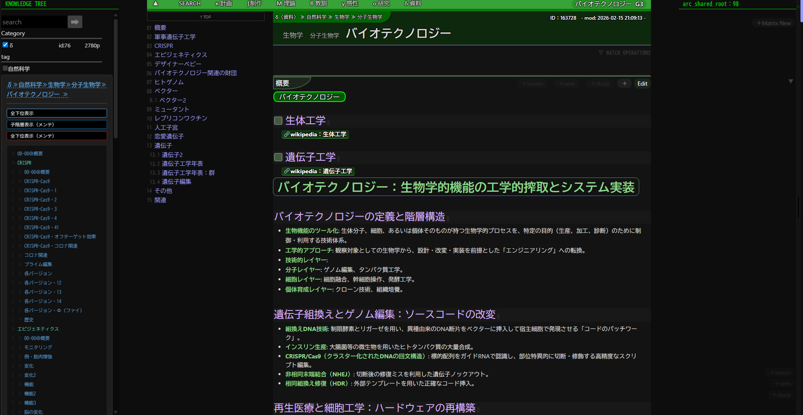
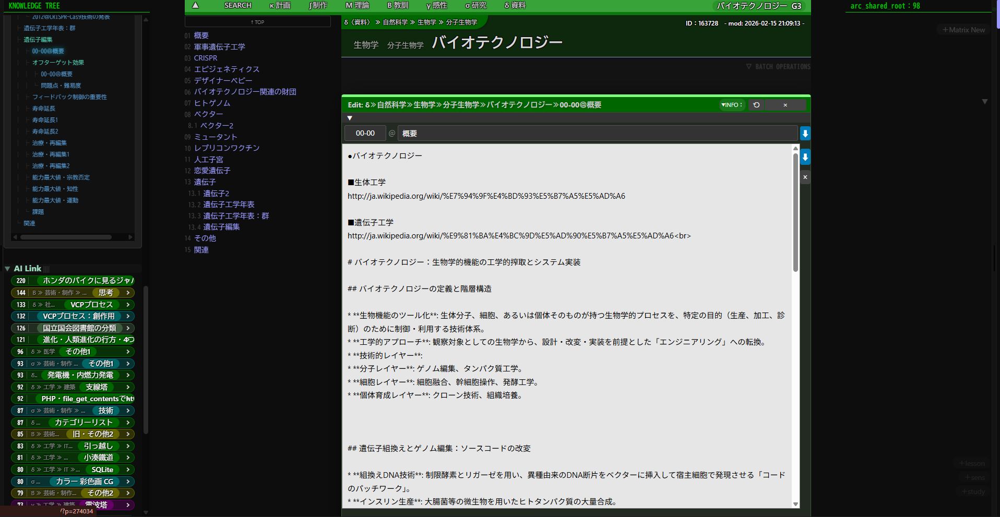

# kasax_child (kasax Child Theme)

> **「概念の階層構造」と「思考の多角性」を動的にマッピングする知能外部ストレージ**

## 概要

`kasax_child` は、WordPressを単なるブログツールではなく、**「創作支援・ナレッジベース」**として運用するために開発された独自の子テーマです。

本プロジェクトは、作者がローカル環境（XAMPP）で日々行っている思考整理、プロット構築を最適化するための「実験的実装」を公開したものです。

**本システムは、日本語特有の多種多様な文字種や、全角記号を用いた複雑な階層管理をスムーズに行えるよう、日本語環境での利用に最適化されています。**

**※注意：** 本テーマは個人利用およびローカル開発環境（XAMPP等）に特化して設計されています。セキュリティや互換性よりも「独自の思考ロジックの実装」を優先しているため、公開サーバー上での利用は推奨しません。

## プレビュー

| 基本表示画面（UI） | 編集・管理画面（エディタ） |
| :--- | :--- |
|  |  |

---

## 独自コンセプト：多層的知能ストレージ

本テーマは、以下の3つの柱によって「情報の多次元化」を試みています。

 **知識の多層配置（Multi-Tree Deployment）**:
論理パス「≫」を用いることで、一つの記事を複数の文脈に同時に存在させ、思考の階層を構築します。

---

## 主な機能とショートコード

多機能すぎて全てを網羅できませんが、コアとなる機能を紹介します。

### 1. 階層化ナビゲーター `[raretu]`

記事タイトルに `A≫B≫C` と記述することで、自動的にディレクトリ構造を解析します。

* 親記事に配置すると、子階層のリストを自動生成。
* 特定のプレフィックスに基づき、UI（カラー）が動的に変化します。

### 2. ポスト・プレフィックスによる視覚的分類

記事タイトルの先頭に特定の文字を付与することで、その情報の性質を定義します。

| プレフィックス | 分類名 | 意味・役割 |
| --- | --- | --- |
| **κ** | 計画 | 戦略・マイルストーン (Planning) |
| **λ** | SYSTEM | システム仕様 (System) |
| **Μ** | 理論 | 理論的背景・分析 (Theory) |
| **Β/γ/σ/δ** | 共有資源 | 教訓・感性・研究・資料（水平連動） |
| **∫** | 制作 | 試作・実験・仮組み |
| **∬00** | 制作 | 本制作 (Execution) |

### 3. ゴースト・クローン `[ghost id=xxx]`

特定記事の「窓」を開きます。参照先の内容をリアルタイムで同期表示するクローンページを作成します。

### 4. 高機能リンク `[kx id=xxx t=60]`

ID指定の内部リンクを生成。パラメータ `t`（タイプ）を切り替えることで、リンクのみ、抜粋表示、全文展開など、情報の密度を柔軟に変更可能です。

---

## システム構成ファイル一覧

本システムは高度にモジュール化されており、以下のクラス群によって制御されています。

📂 構成詳細（admin, batch, core, database, etc.）を表示する

### 📂 admin

| ファイル名 | クラス名 | 説明 |
| --- | --- | --- |
| class-admin-dashboard.php | `AdminDashboard` | システムステータスの可視化、DB診断、および仮想階層の管理。 |
| class-list_table.php | `Kx_List_Table` | 独自データベース（wp_kx_0等）を管理画面に一覧表示・ソート。 |

### 📂 batch

| ファイル名 | クラス名 | 説明 |
| --- | --- | --- |
| class-batch-AdvancedProcessor.php | `AdvancedProcessor` | タイトル・本文の置換、特定テーブルへのデータ移行を一括処理。 |

### 📂 component

| ファイル名 | クラス名 | 説明 |
| --- | --- | --- |
| class-editor.php | `Editor` | モーダルを利用した記事更新やGhost（実体参照）の統合エディター。 |
| class-KxLink.php | `KxLink` | 現在の文脈に最適化されたカード型リンクを動的に生成。 |
| class-post_card.php | `PostCard` | 階層パスに基づく要約・装飾付きカードHTMLの生成。 |
| class-QuickInserter.php | `QuickInserter` | 親階層の文脈を引き継いだ新規投稿作成用インサーター。 |

### 📂 core

| ファイル名 | クラス名 | 説明 |
| --- | --- | --- |
| class-kx-ai-bridge.php | `KxAiBridge` | 投稿データとAI用メタデータの紐付け、LLMコンテキスト供給の最適化。 |
| class-kx-ajax-handler.php | `AjaxHandler` | フロントエンドからのAjaxリクエストを各コアクラスへ仲介。 |
| class-kx-assets.php | `KxAssets` | CSS/JSファイルを階層構造に基づいて一括管理するアセットマネージャー。 |
| class-kx-color-manager.php | `ColorManager` | タイトルや文脈に基づきHSL形式のCSS変数を動的に生成。 |
| class-kx-consolidator.php | `KxConsolidator` | コンテンツの再帰的収集・統合、および外部ファイル出力の制御。 |
| class-kx-content-filter.php | `ContentFilter` | `the_content` フックを介したGhost召喚やMarkdown変換の制御。 |
| class-kx-Content-Processor.php | `ContentProcessor` | Markdownパース、独自記号変換を一括で行う本文変換エンジン。 |
| class-kx-context_manager.php | `ContextManager` | 階層解析、検索テーブル同期などを一元管理する司令塔。 |
| class-kx-director.php | `KxDirector` | システム全体のショートコード登録と主要コンポーネントの中継。 |
| class-kx-dy-content-handler.php | `DyContentHandler` | コンテンツ生データとキャッシュの補充を一元制御。 |
| class-kx-dy-handler.php | `DyDomainHandler` | 外部システム（Laravel等）との連携監視、ドメイン全般の管理。 |
| class-kx-dynamicRegistry.php | `DynamicRegistry` | 実行メモリ内でのデータ管理を一元化するシステム全体のハブ。 |
| class-kx-dy-path-index-handler.php | `DyPathIndexHandler` | 階層パス「≫」を解析し、親ノードや定義名を動的に解決。 |
| class-kx-dy-storage.php | `DyStorage` | 実行メモリ上でのデータの物理的格納を担うストレージクラス。 |
| class-kx-LaravelClient.php | `LaravelClient` | 外部LaravelアプリケーションとのAPI通信インターフェース。 |
| class-kx-outline_manager.php | `OutlineManager` | 本文内の見出しレベルを解析し、目次HTMLを動的に生成。 |
| class-kx-query.php | `KxQuery` | 独自DB、Laravel API、WP_Queryを組み合わせた多層検索エンジン。 |
| class-kx-save-manager.php | `SaveManager` | 投稿保存時のバリデーション、独自テーブル同期、バックアップ。 |
| class-kx-short-code.php | `ShortCode` | `dump`, `ghost`, `raretu` 等のショートコード実行ハンドラー。 |
| class-kx-systemConfig.php | `SystemConfig` | 定数、パス、外部JSON設定を一元管理する構成管理クラス。 |
| class-kx-title-parser.php | `TitleParser` | 命名規則に基づくセマンティック解析および型判定エンジン。 |

### 📂 database

| ファイル名 | クラス名 | 説明 |
| --- | --- | --- |
| class-abstract-data_manager.php | `AbstractDataManager` | 独自テーブルアクセス層の共通基盤となる抽象クラス。 |
| class-DB.php | `DB` | カスタムテーブル（kx_0, kx_1等）の生成、削除、物理バックアップ。 |
| class-dbkx-0-post-search-mapper.php | `dbkx0_PostSearchMapper` | タイトル階層やタイプを `kx_0` テーブルへ高速インデックス同期。 |
| class-dbkx-1-data-manager.php | `dbkx1_DataManager` | ショートコード等の解析済みメタデータを `kx_1` テーブルへ同期。 |
| class-dbkx-ai-metadata-mapper.php | `dbKxAiMetadataMapper` | AI関係の管理テーブルの読み出しとメンテナンス。 |
| class-dbkx-Hierarchy.php | `Hierarchy` | 階層構造パス情報を `kx_hierarchy` テーブルへマッピング。 |
| class-dbkx-shared_title_manager.php | `dbkx_SharedTitleManager` | 系統を跨いだタイトル名寄せによるクロスドメインID紐付け。 |

### 📂 launcher

| ファイル名 | クラス名 | 説明 |
| --- | --- | --- |
| class-kx-post-launcher.php | `KxPostLauncher` | ショートコード `kx` の入力を解析し、出力を制御するランチャー。 |

### 📂 matrix

| ファイル名 | クラス名 | 説明 |
| --- | --- | --- |
| class-1orchestrator.php | `Orchestrator` | `raretu` の実行、データ収集から描画までのパイプライン制御。 |
| class-2query.php | `Query` | 行列表示専用の動的クエリビルダー。 |
| class-3data_collector.php | `DataCollector` | 抽出ID群に対する時間軸解析・前処理クラス。 |
| class-4processor.php | `Processor` | 収集データを年表・行列等の指定形式へ成形するロジック。 |
| class-5renderer.php | `Renderer` | 成形データに基づき最終的なHTMLを出力する描画エンジン。 |

### 📂 parser

| ファイル名 | クラス名 | 説明 |
| --- | --- | --- |
| class-kx-parsedown.php | `KxParsedown` | ParsedownExtraを拡張したシステム専用のMarkdownレンダラー。 |

### 📂 utils

| ファイル名 | クラス名 | 説明 |
| --- | --- | --- |
| class-kx-message.php | `KxMessage` | システム実行中のエラー・通知を一元管理するユーティリティ。 |
| class-kx-taskboard.php | `TaskBoard` | 作業支援用ダッシュボードインターフェースの生成。 |
| class-kx-template.php | `KxTemplate` | ロジックと表示を分離して読み込むテンプレートエンジン。 |
| class-kx-time.php | `Time` | タイムゾーン制御、時間差算出、年齢・日付変更検知。 |
| class-kx-Toolbox.php | `Toolbox` | デバッグ出力、EPUB変換、物理保存等の多目的ツール。 |
| class-kx-UI.php | `KxUI` | ボタン、ラベル等、システム共通のUIコンポーネント生成。 |
| class-kx-wp-tweak.php | `WpTweak` | WordPress標準の挙動をシステム向けに微調整するメンテツール。 |

### 📂 visual

| ファイル名 | クラス名 | 説明 |
| --- | --- | --- |
| class-SideBar.php | `SideBar` | 階層情報、操作パネル、ログを表示するスライド式インターフェース。 |
| class-TitleRenderer.php | `TitleRenderer` | パンくずリストや階層化タイトルの表示専用レンダラー。 |

---

## 開発環境

* **OS**: Windows 10/11 (XAMPP for Windows)
* **PHP**: 8.1.25 以上（必須）
* **WordPress**: 6.0 以上推奨
* **Base Theme**: [_0 (Underscores)](https://underscores.me/)

---

## インストール

1. 親テーマ（`kasax`）を `wp-content/themes/` に配置します。
2. 本子テーマ（`kasax_child`）を `wp-content/themes/` にアップロードします。
3. WordPress管理画面から「kasax Child」を有効化します。
4. （推奨）`paths.json.example` を参考に `paths.json` を作成し、環境に合わせたパスを設定してください。

---

## ライセンス

[GNU General Public License v2 or later](https://www.gnu.org/licenses/gpl-2.0.html) に準拠します。

## クレジット

* **Customized by**: [yusuke-kasai-kasouya](https://github.com/yusuke-kasai-kasouya/)
* **Base Theme**: [_0 (Underscores)](https://underscores.me/) by Automattic

---

### コミュニケーションについて

制作者は日本語を母国語としています。英語での問い合わせも翻訳ツールを介して対応可能ですが、日本語でいただけるとよりスムーズな回答が可能です。

> **Note:** 本ドキュメントは、内部コード構造を正確に反映するためAI（Gemini）の支援を受けて作成されました。

