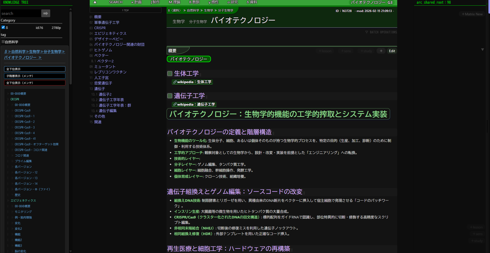
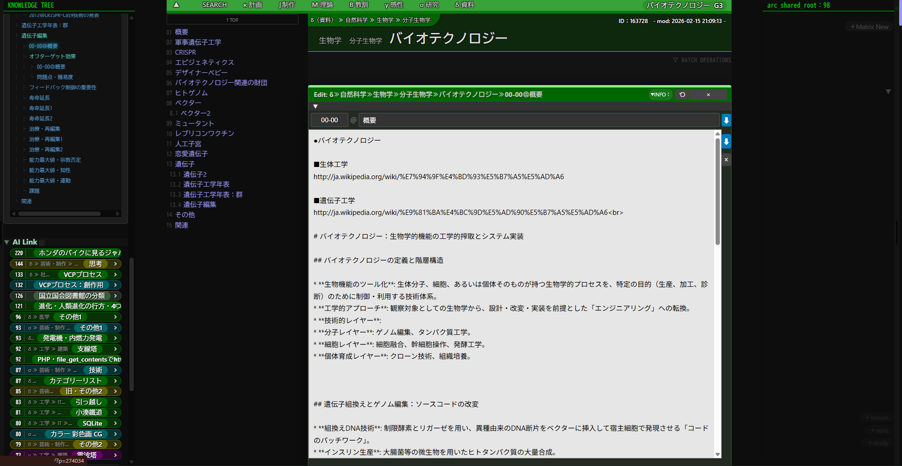

# kasax_child (kasax Child Theme)

**Version: 0.2026.0904**

> **「概念の階層構造」と「思考の多角性」を動的にマッピングする知能外部ストレージ**

## 概要

`kasax_child` は、WordPressを単なるブログツールではなく、**「創作支援・ナレッジベース」**として運用するために開発された独自の子テーマです。

本プロジェクトは、作者がローカル環境（XAMPP）で日々行っている思考整理、プロット構築を最適化するための「実験的実装」を公開したものです。

**本システムは、日本語特有の多種多様な文字種や、全角記号を用いた複雑な階層管理をスムーズに行えるよう、日本語環境での利用に最適化されています。**

**※注意：** 本テーマは個人利用およびローカル開発環境（XAMPP等）に特化して設計されています。セキュリティや互換性よりも「独自の思考ロジックの実装」を優先しているため、公開サーバー上での利用は推奨しません。

## プレビュー

| 基本表示画面（UI） | 編集・管理画面（エディタ） |
| :--- | :--- |
|  |  |

---

## 独自コンセプト：多層的知能ストレージ

本テーマは、以下の3つの柱によって「情報の多次元化」を試みています。

### 知識の多層配置（Multi-Tree Deployment）
論理パス「≫」を用いることで、一つの記事を複数の文脈に同時に存在させ、思考の階層を構築します。

---

## 主な機能とショートコード

### 1. 階層化ナビゲーター `［raretu］`

記事タイトルに `A≫B≫C` と記述することで、自動的にディレクトリ構造を解析します。

* 親記事に配置すると、子階層のリストを自動生成。
* 特定のプレフィックスに基づき、UI（カラー）が動的に変化します。

### 2. ポスト・プレフィックスによる視覚的分類

記事タイトルの先頭に特定の文字を付与することで、その情報の性質を定義します。

| プレフィックス | 分類名 | 意味・役割 |
| --- | --- | --- |
| **κ** | 計画 | 戦略・マイルストーン (Planning) |
| **λ** | SYSTEM | システム仕様 (System) |
| **Μ** | 理論 | 理論大系・分析 (Theory) |
| **Β/γ/σ/δ** | 共有資源 | 教訓・感性・研究・資料（水平連動） |
| **∫** | 制作 | 試作・実験・仮組み |
| **∬00** | 制作 | 本制作 (Execution) |

### 3. ゴースト・クローン `［ghost id=xxx］`

特定記事の「窓」を開きます。参照先の内容をリアルタイムで同期表示するクローンページを作成します。

### 4. インライン・モーダルエディタ

画面遷移なしに記事を編集可能な独自UIを提供します。

* **INFO領域**: 初回投稿日および最新更新日を可視化。
* **コンソリデータ**: 複数記事を統合してAI用テキストやEPUBを出力する統合機。

---

## システム構成ファイル一覧

### 📂 admin

| ファイル名 | クラス名 | 説明 |
| --- | --- | --- |
| class-admin-dashboard.php | `AdminDashboard` | システムステータス可視化、DB診断、仮想階層管理。 |
| class-list_table.php | `Kx_List_Table` | 独自DB（wp_kx_0等）の管理画面一覧表示・ソート。 |

### 📂 batch

| ファイル名 | クラス名 | 説明 |
| --- | --- | --- |
| class-batch-AdvancedProcessor.php | `AdvancedProcessor` | タイトル・本文の置換、特定テーブルへのデータ一括移行。 |

### 📂 component

| ファイル名 | クラス名 | 説明 |
| --- | --- | --- |
| class-editor.php | `Editor` | 投稿・更新、および作成/更新日時を表示するINFO機能付エディタ。 |
| class-KxLink.php | `KxLink` | 文脈に最適化されたカード型リンクを動的に生成。 |
| class-post_card.php | `PostCard` | 階層パスに基づく要約・装飾付きカードHTML生成。 |
| class-QuickInserter.php | `QuickInserter` | 親階層の文脈を引き継いだ新規投稿作成用インサーター。 |

### 📂 core

| ファイル名 | クラス名 | 説明 |
| --- | --- | --- |
| class-kx-ai-bridge.php | `KxAiBridge` | AI用メタデータの紐付け、LLMコンテキスト供給最適化。 |
| class-kx-ajax-handler.php | `AjaxHandler` | フロントエンドからのAjaxリクエストを各コアクラスへ仲介。 |
| class-kx-assets.php | `KxAssets` | CSS/JSファイルを階層構造に基づいて一括管理。 |
| class-kx-color-manager.php | `ColorManager` | 文脈に基づきHSL形式のCSS変数を動的に生成。 |
| class-kx-consolidator.php | `KxConsolidator` | 多段階サニタイズ（Lv0-5）およびAI制限分割出力の制御。 |
| class-kx-content-filter.php | `ContentFilter` | `the_content` フックを介したGhost召喚や変換制御。 |
| class-kx-Content-Processor.php | `ContentProcessor` | Markdownパース、独自記号変換を行う本文変換エンジン。 |
| class-kx-context_manager.php | `ContextManager` | 階層解析、検索テーブル同期を統括する司令塔。 |
| class-kx-director.php | `KxDirector` | ショートコード登録と主要コンポーネントの中継。 |
| class-kx-dy-content-handler.php | `DyContentHandler` | コンテンツ生データと三層キャッシュ（raw/ana/vis）の制御。 |
| class-kx-dy-handler.php | `DyDomainHandler` | 外部連携監視（Laravel等）、ドメイン全般の管理。 |
| class-kx-dynamicRegistry.php | `DynamicRegistry` | 実行メモリ内でのデータ管理を一元化するハブ。 |
| class-kx-dy-path-index-handler.php | `DyPathIndexHandler` | 「≫」解析、定義名解決、および投稿・更新日時のキャッシュ。 |
| class-kx-dy-storage.php | `DyStorage` | 実行メモリ上でのデータの物理的格納を担う。 |
| class-kx-LaravelClient.php | `LaravelClient` | 外部LaravelアプリケーションとのAPI通信インターフェース。 |
| class-kx-outline_manager.php | `OutlineManager` | 見出しレベル解析、自動アンカー、目次HTML生成。 |
| class-kx-query.php | `KxQuery` | 独自DB、Laravel、WP_Queryを組み合わせた多層検索。 |
| class-kx-save-manager.php | `SaveManager` | 投稿保存時のバリデーション、独自テーブル整合性保証。 |
| class-kx-short-code.php | `ShortCode` | 各種ショートコード（ghost, raretu等）のハンドラー。 |
| class-kx-systemConfig.php | `SystemConfig` | 定数、パス、外部JSON設定（スキーマ）の管理。 |
| class-kx-title-parser.php | `TitleParser` | セマンティック解析および型判定エンジン。 |

### 📂 database

| ファイル名 | クラス名 | 説明 |
| --- | --- | --- |
| class-abstract-data_manager.php | `AbstractDataManager` | 独自テーブルアクセス層の共通基盤。 |
| class-DB.php | `DB` | カスタムテーブル生成、物理バックアップ。 |
| class-dbkx-0-post-search-mapper.php | `dbkx0_PostSearchMapper` | タイトル階層やタイプを `kx_0` テーブルへ高速インデックス同期。 |
| class-dbkx-1-data-manager.php | `dbkx1_DataManager` | メタデータを `kx_1` テーブルへ同期。 |
| class-dbkx-ai-metadata-mapper.php | `dbKxAiMetadataMapper` | AIメタデータテーブルの管理とメンテナンス。 |
| class-dbkx-Hierarchy.php | `Hierarchy` | 階層構造パス情報を `kx_hierarchy` テーブルへマッピング。 |
| class-dbkx-shared_title_manager.php | `dbkx_SharedTitleManager` | クロスドメイン名寄せによる概念ID紐付け。 |

### 📂 launcher

| ファイル名 | クラス名 | 説明 |
| --- | --- | --- |
| class-kx-post-launcher.php | `KxPostLauncher` | ショートコード `kx` の入力を解析し、密度を制御。 |

### 📂 matrix

| ファイル名 | クラス名 | 説明 |
| --- | --- | --- |
| class-1orchestrator.php | `Orchestrator` | 行列表示（Matrix）の描画パイプライン制御。 |
| class-2query.php | `Query` | 行列表示専用の動的クエリビルダー。 |
| class-3data_collector.php | `DataCollector` | 時間軸解析、属性前処理。 |
| class-4processor.php | `Processor` | 年表・行列形式への成形ロジック。 |
| class-5renderer.php | `Renderer` | 最終的なHTML描画エンジン。 |

### 📂 parser

| ファイル名 | クラス名 | 説明 |
| --- | --- | --- |
| class-kx-parsedown.php | `KxParsedown` | LaTeX数式保護機能を備えた独自Markdownレンダラー。 |

### 📂 utils

| ファイル名 | クラス名 | 説明 |
| --- | --- | --- |
| class-kx-message.php | `KxMessage` | 実行中エラー・通知の一元管理。 |
| class-kx-workstation.php | `WorkStation` | 動的スキャンによる高度な執筆支援ボード。 |
| class-kx-taskboard.php | `TaskBoard` | 検索・メニュー等のダッシュボード生成。 |
| class-kx-template.php | `KxTemplate` | ロジックと表示を分離する独自エンジン。 |
| class-kx-time.php | `Time` | タイムゾーン、時間差算出、年齢・日付変更検知。 |
| class-kx-Toolbox.php | `Toolbox` | クリップボード、EPUB、物理保存等の多目的ツール。 |
| class-kx-UI.php | `KxUI` | 共通UIコンポーネント生成。 |
| class-kx-wp-tweak.php | `WpTweak` | WordPress標準の挙動をシステム向けに微調整。 |

### 📂 visual

| ファイル名 | クラス名 | 説明 |
| --- | --- | --- |
| class-SideBar.php | `SideBar` | 階層情報、操作パネルのスライド式インターフェース。 |
| class-TitleRenderer.php | `TitleRenderer` | パンくず・階層タイトルの表示専用レンダラー。 |

---

## 開発環境

* **OS**: Windows 10/11 (XAMPP for Windows)
* **PHP**: 8.1.25 以上（必須）
* **WordPress**: 6.0 以上推奨
* **Base Theme**: [_0 (Underscores)](https://underscores.me/)

---

## ライセンス

[GNU General Public License v2 or later](https://www.gnu.org/licenses/gpl-2.0.html) に準拠します。

---

## クレジット

* **Customized by**: [yusuke-kasai-kasouya](https://github.com/yusuke-kasai-kasouya/)
* **Base Theme**: [_0 (Underscores)](https://underscores.me/) by Automattic

---

> **Note:** 本ドキュメントは、内部コード構造を正確に反映するためAI（Gemini）の支援を受けて作成されました。記述の便宜上、ショートコード例示には全角ブラケット（［ ］）を使用しています。
